# Introduction to MongoDB

Let's install and run MongoDB with docker via WSL:

```Terminal
kiselev@terminal:wsl
kiselev@terminal:sudo apt install apt-transport-https ca-certificates curl software-properties-common
kiselev@terminal:curl -fsSL https://download.docker.com/linux/ubuntu/gpg | sudo apt-key add -
kiselev@terminal:sudo add-apt-repository "deb [arch=amd64] https://download.docker.com/linux/ubuntu $(lsb_release -cs) stable"
kiselev@terminal:sudo apt update
kiselev@terminal:docker pull mongo
kiselev@terminal:sudo docker pull mongo
kiselev@terminal:sudo docker run --name my_mongo -d -p 27017:27017 mongo
kiselev@terminal:sudo docker ps -a
```

Now let's try to connect to the server:

```Terminal
kiselev@terminal:sudo service docker start
kiselev@terminal:sudo docker exec -it my_mongo mongosh
test>
```

We import data into the database, having previously created it:

```Terminal
kiselev@terminal:nano data.json
```

```Nano
Nano: [
    {
        "name": "Alice",
        "age": 30,
        "city": "New York"
    },
    {
        "name": "Bob",
        "age": 25,
        "city": "Los Angeles"
    },
    {
        "name": "Charlie",
        "age": 35,
        "city": "Chicago"
    }
]
```

Сopy the file into the container:

```Terminal
kiselev@terminal:docker cp data.json my_mongo:/data/db
```

Import data into the database:

```Terminal
sudo docker exec -it my_mongo mongoimport --jsonArray --db mydb --collection people --file /data.json
```

Let's enter the container:

```Terminal
kiselev@terminal:sudo docker exec -it my_mongo mongosh
```

Let's check the availability of our database:

```Terminal
test> show dbs
admin   40.00 KiB
config  72.00 KiB
local   40.00 KiB
mydb    40.00 KiB
```

Let's look at the contents of the database:

```Terminal
test> use mydb
switched to db mydb
```

```Terminal
mydb> show collections
people
```

```Terminal
mydb> db.people.find().pretty()
```

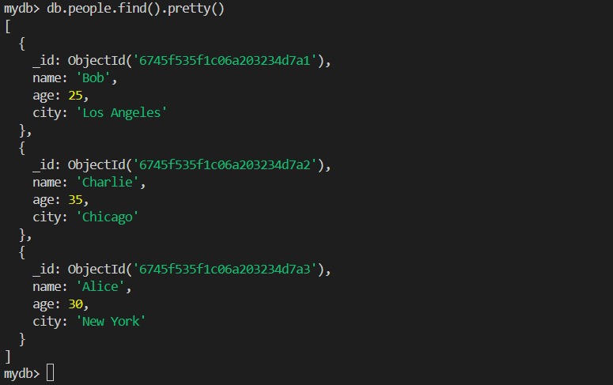

Great, we've learned how to run Mongo in Docker and import data into the container and the database itself.

Now let's learn simple commands for interacting with the database to view or edit data.

Let's assume we are working with a forum in which we have users.json and posts.json data. Let's load them into a new database forum.

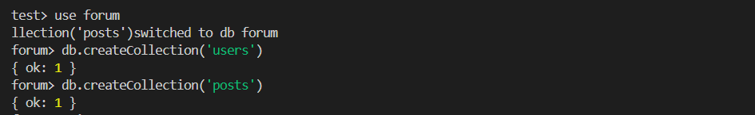

```Terminal
sudo docker cp users.json my_mongo:/data/users.json
sudo docker cp posts.json my_mongo:/data/posts.json
```

```Terminal
sudo docker exec -it my_mongo mongoimport --db forum --collection users --file /data/users.json --jsonArray
```

```Terminal
sudo docker exec -it my_mongo mongoimport --db forum --collection posts --file /data/posts.json --jsonArray
```

Let's check the availability of data in the database:

```Terminal
sudo docker exec -it my_mongo mongosh
use forum
db.users.find().pretty()
db.posts.find().pretty()
```

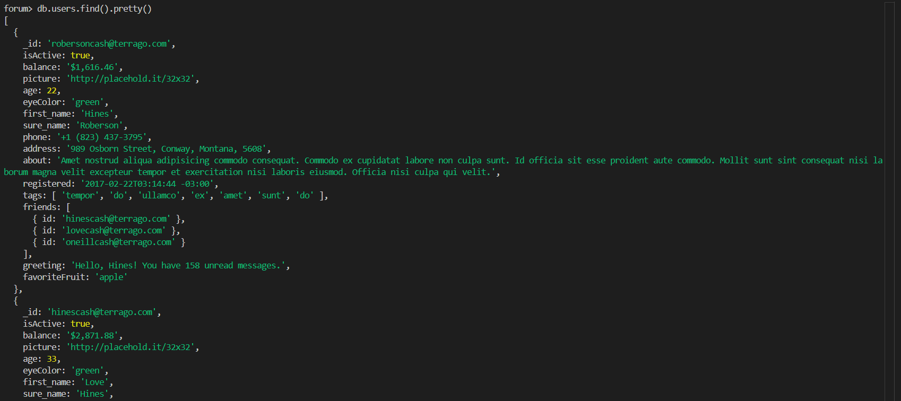

Let's try to find data about a specific user in our database:

```Terminal
forum> db.users.find({"_id":"robersoncash@terrago.com"})
```

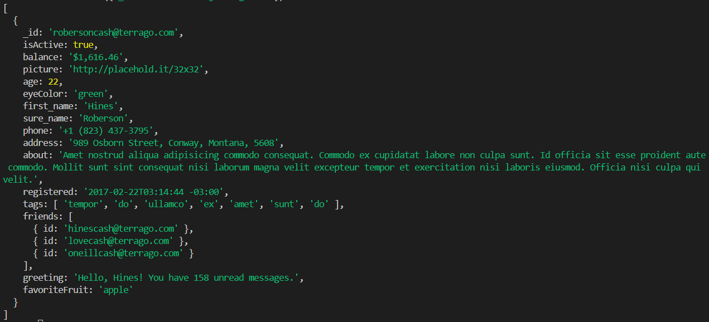

We can also sort the output by users who are, for example: currently active:

```Terminal
db.users.find({ isActive: true }).pretty()
```

or count their number using the appropriate function:

```Terminal
db.users.countDocuments({ isActive: true })
```

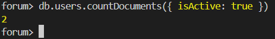

users with a certain eye color:

```Terminal
db.users.find({ eyeColor: "green" }).pretty()
```

over 30 years old:

```Terminal
db.users.find({ age: { $gt: 30 } }).pretty()
```

Or, for example, let's update the user's balance:

```Terminal
db.users.updateOne(
  { _id: "robersoncash@terrago.com" },
  { $set: { balance: "$2,000.00" } }
)
```

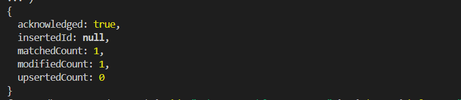

We can remove inactive users:

```Terminal
db.users.deleteMany({ isActive: false })
```

We can also find users who are friends with a specific user:

```Terminal
db.users.find(
  {
    "friends.id": "hinescash@terrago.com"
  },
  { sure_name: 1, first_name: 1, phone: 1 }
)
```

Get all comments for a post by a specific author:

```Terminal
db.posts.aggregate([
  { $match: { author: "robersoncash@terrago.com" } },
  { $unwind: "$comments" },
  { $project: { "comments.content": 1, "comments.author": 1 } }
])
```

Get posts with comments where the author of the comment is an active user:

```Terminal
db.posts.aggregate([
  { $lookup: {
      from: "users",
      localField: "comments.author",
      foreignField: "_id",
      as: "commentAuthors"
    }
  },
  { $unwind: "$comments" },
  { $match: { "commentAuthors.isActive": true } },
  { $project: { "comments.content": 1, "comments.author": 1, "author": 1 } }
])
```

Now let's add a new post to our json file:

```Terminal
forum> db.posts.insertOne({  author: "Antony@terrago.com",  content: "This is a new post discussing various topics including veniam.",  createdAt: new Date(),  updatedAt: new Date(),  tags: ["ven", "new", "discussion"],  likes: 100,  comments: []})
```

Result:

```Terminal
{
  acknowledged: true,
  insertedId: ObjectId('67462fd0ac5018c20cc1c18d')
}
```

A regular expression in MongoDB is a generalized way to match patterns against character sequences.

MongoDB uses Perl Compatible Regular Expressions (PCRE) version 8.42 with UTF-8 support.

Pattern matching can be done in two ways in MongoDB:

With the $regex operator. This operator provides the power of regular expressions to perform pattern matching operations in queries.

Without the $regex operator.

A regular expression is especially useful when the exact value of a field is unknown. It allows flexible and efficient searching of collections.

```Terminal
db.posts.find(
  { content: { $regex: /ven/i } },
  { _id: 1, author: 1, content: 1 }
)
```

- content: { $regex: /ven/i }: This filter finds documents where the content field contains the substring "ven". The i flag makes the search case-insensitive, allowing it to find both "ven" and "Ven", "VEN", etc.
- { \_id: 1, author: 1, content: 1 }: This projection operator returns only the \_id, author, and content fields of the found documents.

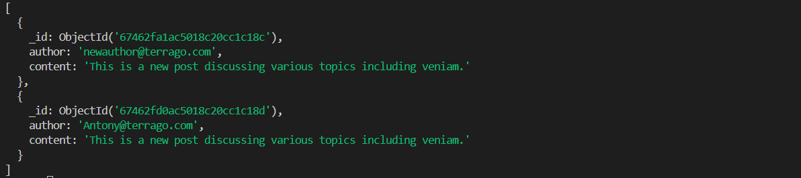

## Updating data in Mongo

There are several ways to update data in collections in MongoDB. Here are the main methods you can use:

1. updateOne()
   This method updates the first document that matches the specified criteria. If multiple documents match the criteria, only the first one will be updated. Syntax:

```Terminal
db.posts.updateOne(
  { _id: ObjectId("67462fa1ac5018c20cc1c18c") },
  { $set: { content: "Updated content for this post." } }
)
```

2. updateMany()
   This method updates all documents that match the given criteria. Syntax:

```Terminal
db.posts.updateMany(
  { tags: "ven" }, // Условие для выбора постов
  { $addToSet: { tags: "updatedTag" } }
)
```

3. replaceOne()
   This method replaces the entire document that matches the given criteria with a new document. Syntax:

```Terminal
db.posts.replaceOne(
 { _id: ObjectId("67462fa1ac5018c20cc1c18c") }, // Condition for selecting a post
 {
 author: "newauthor@terrago.com",
 content: "This is a completely new post.",
 tags: ["new", "post"],
 likes: 0,
 comments: []
 } // New document
)
```

4. update()

MongoDB provides a variety of update operators that can be used in the updateOne() and updateMany() methods. Here are some of them:

- $set: Sets the value of a field.
- $unset: Removes a field from the document.
- $inc: Increments the value of a field by a given number.
- $push: Adds an element to an array.
- $addToSet: Adds an element to an array only if it is not already there.
- $pop: Removes the first or last element from an array.

Sets the number of likes:

```Terminal
db.posts.updateOne(
  { _id: ObjectId("67462fa1ac5018c20cc1c18c") },
  { $set: { likes: 10 } }
)
```

Increases the number of likes by 1:

```Terminal
db.posts.updateOne(
  { _id: ObjectId("67462fa1ac5018c20cc1c18c") },
  { $inc: { likes: 1 } }
)
```

Adds a new comment:

```Terminal
db.posts.updateOne(
  { _id: ObjectId("67462fa1ac5018c20cc1c18c") },
  { $push: { comments: { author: "user@terrago.com", content: "Great post!" } } }
)
```

## Data types in Mongo

MongoDB supports a variety of data types that can be used to store information in documents. Here are the main data types you can use in MongoDB:

1. String
   Description: Strings are sequences of characters.
2. Integer
   Description: Integers can be 32-bit or 64-bit.
3. Double
   Description: Floating-point numbers (64-bit).
4. Boolean
   Description: Boolean values ​​that can be either true or false.
5. Array
   Description: Arrays can contain values ​​of any data type, including other arrays and objects.
6. Object
   Description: Objects are a collection of key-value pairs. They are the primary way to store data in MongoDB.
7. Null
   Description: A special type that represents the absence of a value.
8. Date
   Description: Date and time stored in UTC format.
9. ObjectId
   Description: A unique identifier that is automatically generated for each document in the collection. It consists of 12 bytes and is typically used as the \_id value.
10. Binary Data
    Description: Data in binary format that can be used to store images, files, and other binary data.
11. Regular Expression
    Description: Regular expressions can be used to find strings that match certain patterns.

Within our collections, data is presented as follows:

1. String

```Terminal
db.posts.insertOne({
author: "john.doe@example.com", // String
content: "This is a sample post content.", // String
tags: ["sample", "post"] // Array of strings
})
```

2. Integer
   Insert example:

```Terminal
db.posts.insertOne({
author: "jane.doe@example.com",
content: "Another post content.",
likes: 10, // Integer
commentsCount: 2 // Integer
})
```

3. Double
   Insert example:

```Terminal
db.posts.insertOne({
author: "user@example.com",
content: "Post with a rating.",
rating: 4.5 // Float
})
```

4. Boolean
   Insert example:

```Terminal
db.posts.insertOne({
author: "admin@example.com",
content: "This post is featured.",
isFeatured: true // Boolean value
})
```

5. Array
   Example of insertion:

```Terminal
db.posts.insertOne({
author: "author@example.com",
content: "Post with multiple tags.",
tags: ["mongodb", "database", "nosql"] // Array of strings
})
```

6. Object
   Example of insertion:

```Terminal
db.posts.insertOne({
author: "editor@example.com",
content: "Post with author details.",
authorDetails: { // Object
name: "Editor Name",
email: "editor@example.com"
}
})
```

7. Null
   Example of insertion:

```Terminal
db.posts.insertOne({
author: "unknown@example.com",
content: "Post with no specific category.",
category: null // None values
})
```

8. Date
   Insert example:

```Terminal
db.posts.insertOne({
author: "timestamp@example.com",
content: "Post with a timestamp.",
createdAt: new Date(), // Date and time
updatedAt: new Date() // Date and time
})
```

9. ObjectId
   Insert example:

```Terminal
db.posts.insertOne({
_id: ObjectId("507f1f77bcf86cd799439011"), // Unique identifier
author: "unique@example.com",
content: "Post with a specific ObjectId."
})
```

10. Binary Data
    Insert example:

```Terminal
db.posts.insertOne({
author: "image@example.com",
content: "Post with an image.",
image: BinData(0, "base64_encoded_image_data") // Binary data
})
```

11. Regular Expression
    Search example:

```Terminal
db.posts.find({
content: { $regex: /sample/i } // Search by regular expression
})
```

## Indexes in MongoDB

Indexes in MongoDB are data structures that improve the speed of searching and sorting operations in collections. They work similarly to indexes in books, allowing you to quickly find the pages you need without having to scan the entire book. Here are the main aspects of indexes in MongoDB:

1. Why use indexes?

Speed ​​up searching: Indexes allow MongoDB to quickly find documents that match certain criteria without having to scan the entire collection.

Improved performance: They significantly improve the performance of read operations, especially on large collections.
Sorting: Indexes can be used to speed up sorting operations.

2. Index Types

MongoDB supports several types of indexes:

- Regular Indexes: Indexes created by default on fields that are frequently used in queries. An example of creating a regular index:

```Terminal
db.posts.createIndex({ author: 1 }) // An index on the author field in ascending order
```

- Unique Indexes: These indexes ensure that the values ​​in the indexed field are unique. An example of creating a unique index:

```Terminal
db.posts.createIndex({ email: 1 }, { unique: true }) // A unique index on the email field
```

- Compound Indexes: Indexes that are created on multiple fields. An example of creating a compound index:

```Terminal
db.posts.createIndex({ author: 1, createdAt: -1 }) // An index on the author field and the createdAt field in descending order
```

- Text Search Indexes: These indexes allow text searches on string fields. Example of creating a text index:

```Terminal
db.posts.createIndex({ content: "text" }) // Text index on the content field
```

3. Managing Indexes

- Viewing Indexes: To see all indexes in a collection, use the command:

```Terminal
db.posts.getIndexes()
```

- Dropping an Index: To drop an index, use the command:

```Terminal
db.posts.dropIndex("indexName") // Replace indexName with the name of the index
```

4. When to use indexes?

Use indexes on fields that are frequently used in find, sort, and aggregate conditions.

Avoid creating indexes on fields that have low selectivity (e.g. fields with a small number of unique values).

5. Disadvantages of Indexes

Memory Cost: Indexes take up additional memory space.

Slower Write Operations: Every time you add, update, or delete documents, indexes must also be updated, which can slow down write operations.

Let's work with the collections and indexes in MongoDB.

1. Create a regular index

If you often search posts by author, you can create a regular index on the author field.

```Terminal
db.posts.createIndex({ author: 1 })
```

2. Viewing Indexes

Once you have created an index, you can view all the indexes in the collection to make sure your index is present:

```Terminal
db.posts.getIndexes()
```

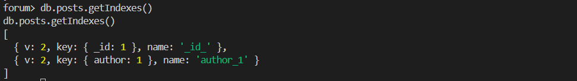

3. Checking Query Performance

To check whether MongoDB is using an index when executing a query, you can use the explain() method. For example, run the following query:

```Terminal
db.posts.find({ author: "john.doe@example.com" }).explain("executionStats")
```

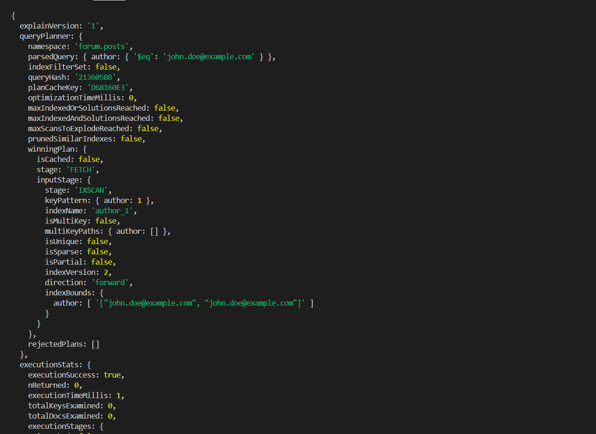

4. Analyzing the results

The explain() command will give you information about how MongoDB executed the query. Note the following fields:

- winningPlan: Shows what plan was chosen to execute the query. If an index was used, you will see it in this section.
- inputStage: If an index was used, you will see information about the index type and the fields on which it was created.
- nReturned: The number of documents returned by the query.
- executionTimeMillis: The execution time of the query in milliseconds.

Now let's try to delete the index:

```Terminal
db.posts.dropIndex("author_1")
```

Please note that if we want to create a unique index, but the data will be duplicated, we will get an error:

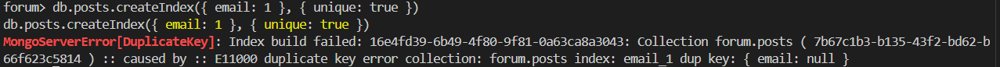

Let's add a composite index:

```Terminal
db.posts.createIndex({ author: 1, createdAt: -1 })
db.posts.getIndexes()
```

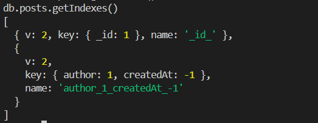

Let's check the functionality:

```Terminal
db.posts.find({ author: "john.doe@example.com" }).sort({ createdAt: -1 }).explain("executionStats");
```

The index on the author and createdAt fields works correctly, and the query successfully returns a document with author equal to john.doe@example.com. This confirms that the index is effectively used to optimize search.

Let's create a text index:

```Terminal
db.posts.createIndex({ content: "text" })
db.posts.getIndexes()
```

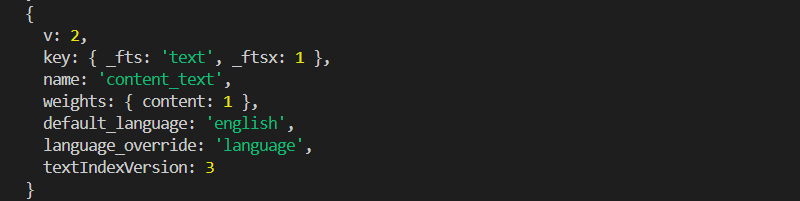

Let's check the functionality:

```Terminal
db.posts.find({ $text: { $search: "Lorem" } })
```

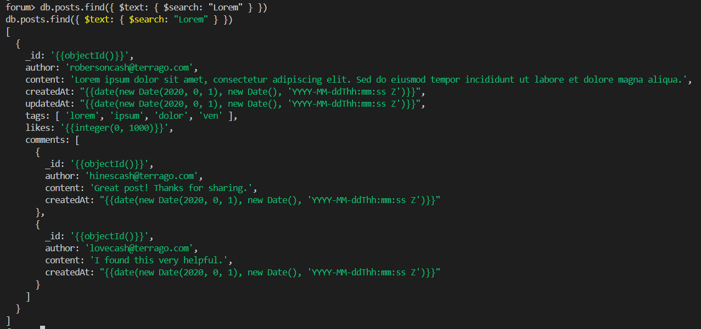

Let's delete the created indexes:

```Terminal
db.posts.dropIndexes()
```

Indexes in MongoDB can be used not only to optimize searches, but also to ensure that values ​​in certain fields are unique. This allows indexes to be used as constraints, for example, to prevent duplicate records.

For example, we want to impose a constraint on the phone field in the users collection. We can create a unique index on this field. This ensures that no two users in the collection have the same phone number.Let's not forget to make sure there are no duplicate values:

```Terminal
db.users.aggregate([
  { $group: { _id: "$phone", count: { $sum: 1 } } },
  { $match: { count: { $gt: 1 } } }
])
```

Once we have verified that all values ​​in the phone field are unique, we can create a unique index:

```Terminal
db.users.createIndex({ phone: 1 }, { unique: true })
```

When trying to add data that is duplicated by a unique key, we get an error:

```Terminal
db.users.insertMany([
  {
    "_id": "duplicate1@terrago.com",
    "isActive": true,
    "balance": "1500",
    "picture": "http://placehold.it/32x32",
    "age": 25,
    "eyeColor": "blue",
    "first_name": "John",
    "sure_name": "Doe",
    "phone": "+1 (823) 437-3795", // !!!
    "address": "123 Example St, City, State, 12345",
    "about": "This is a duplicate entry for testing.",
    "registered": "2023-01-01T00:00:00 -03:00",
    "tags": ["test", "duplicate"]
  },
  {
    "_id": "duplicate2@terrago.com",
    "isActive": true,
    "balance": "2000",
    "picture": "http://placehold.it/32x32",
    "age": 30,
    "eyeColor": "green",
    "first_name": "Jane",
    "sure_name": "Smith",
    "phone": "+1 (808) 421-3385", // !!!
    "address": "456 Sample Rd, Town, State, 67890",
    "about": "This is another duplicate entry for testing.",
    "registered": "2023-01-02T00:00:00 -03:00",
    "tags": ["test", "duplicate"]
  }
]);
```

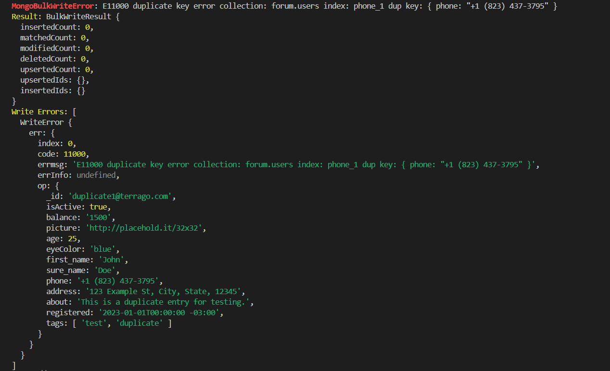

Aggregation in Mongo

Aggregation Pipelines in MongoDB are a powerful tool for processing and analyzing data. They allow you to perform complex operations such as filtering, grouping, sorting, and transforming data. Aggregation Pipelines consist of a sequence of stages, each of which performs a specific operation on documents.

Main steps of Aggregation Pipelines

- $match: Filters documents to pass only those that match certain criteria.
- $group: Groups documents by a specific field and allows performing aggregate functions such as sum, avg, count, etc.
- $sort: Sorts documents by a specified field.
- $project: Modifies the structure of documents by selecting certain fields or creating new ones.
- $limit: Limits the number of documents returned.
- $skip: Skips a specified number of documents.

At the beginning of the document we already used $match for filtering.

Let's group some queries together:

```Terminal
db.users.aggregate([
  { $match: { isActive: true } },
  { $group: { _id: "$age", count: { $sum: 1 } } },
  { $sort: { count: -1 } }
]);
```

Result:

```Terminal
[ { _id: 22, count: 1 }, { _id: 33, count: 1 } ]
```

Let's create an even more complex Aggregation Pipeline example that will include multiple steps such as filtering, grouping, sorting, and using additional aggregate functions. In this example, we will:

1. Filter users by activity status.
2. Group users by first and last name.
3. Count the total number of users with the same first and last name.
4. Calculate the average age of users with the same first and last name.
5. Sort the results by the number of users and output the information in a human-readable format.

```Terminal
db.users.aggregate([
{
$match: {
isActive: true // Filter only active users
}
},
{
$group: {
_id: {
firstName: "$first_name",
lastName: "$sure_name"
},
count: { $sum: 1 }, // Calculate the number of users
averageAge: { $avg: "$age" } // Calculate the average age
}
},
{
$project: {
_id: 0,
fullName: { $concat: ["$_id.firstName", " ", "$_id.lastName"] },
count: 1,
averageAge: { $round: ["$averageAge", 1] } // Round the average age to 1 decimal place
}
},
{
$sort: { count: -1, averageAge: 1 } // Sort by count and average age
}
]);
```

Result:

```Terminal
[
  { count: 1, fullName: 'Hines Roberson', averageAge: 22 },
  { count: 1, fullName: 'Love Hines', averageAge: 33 }
]
```

- $match:
  We filter the documents to include only active users (isActive: true).
- $group:
We group the documents by the first_name and sure_name fields.
We use $sum: 1 to count the number of users with the same first and last name.
We use $avg: "$age" to calculate the average age of users with the same first and last name.
- $project:
  We create a new field fullName that concatenates first_name and sure_name into one string.
  We set \_id: 0 to exclude the \_id field from the output.
  We round the average age to one decimal place.
- $sort:
  We sort the results first by the number of users in descending order, and then by the average age in ascending order.

## Stored procedures and transactions

MongoDB does not have traditional stored procedures like relational databases, but it does have the ability to use functions and transactions to manage data. Let's look at what functions and transactions are in MongoDB and give examples of how to use them.

### Stored Procedures

In MongoDB, you can create functions that can be used to perform repetitive tasks. These functions can be defined in JavaScript and are executed on the MongoDB server.

### Example Function

Here is an example function that adds a new user to a collection. Let's save the function in mongo shell:

```JavaScript
function addUser(firstName, lastName, age, email) {
    return db.users.insertOne({
        first_name: firstName,
        sure_name: lastName,
        age: age,
        email: email,
        isActive: true
    });
}
```

Now let's add the data:

```Terminal
forum> addUser("John", "Doe", 30, "john.doe@example.com");
```

Result:

```Terminal
{
  acknowledged: true,
  insertedId: ObjectId('674658717abe2a4e34c1c18d')
}
```

Let's check that the data has been successfully saved to the database:

```Terminal
forum> db.users.find().pretty();
```

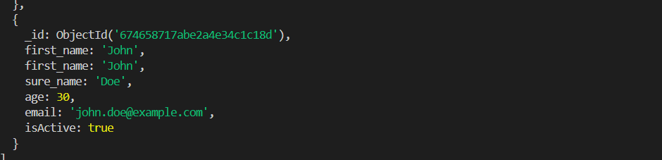
