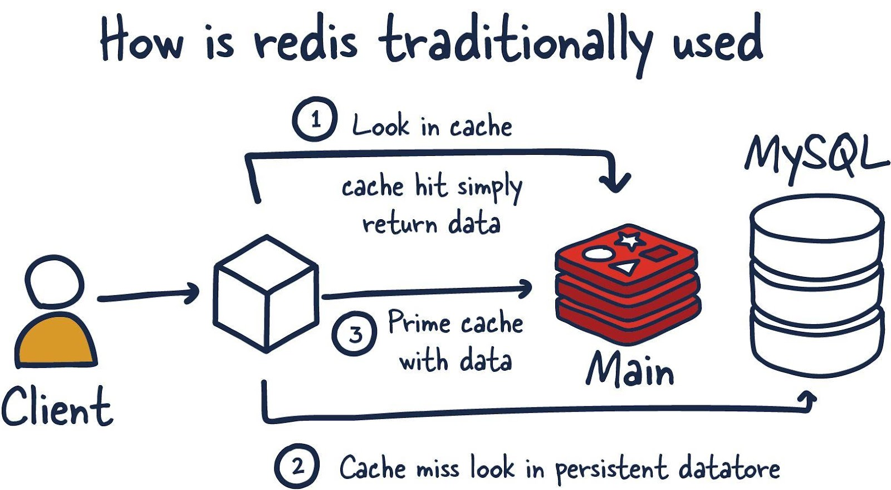
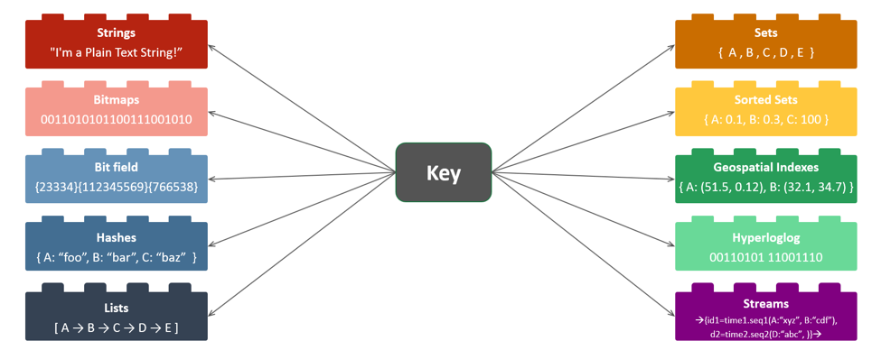
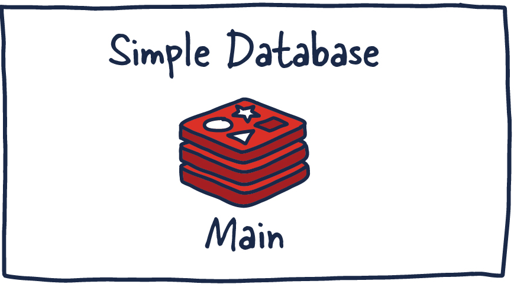
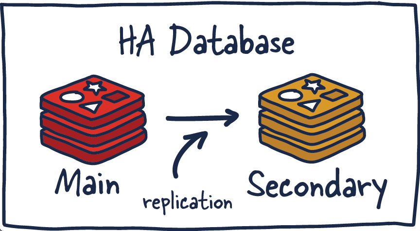
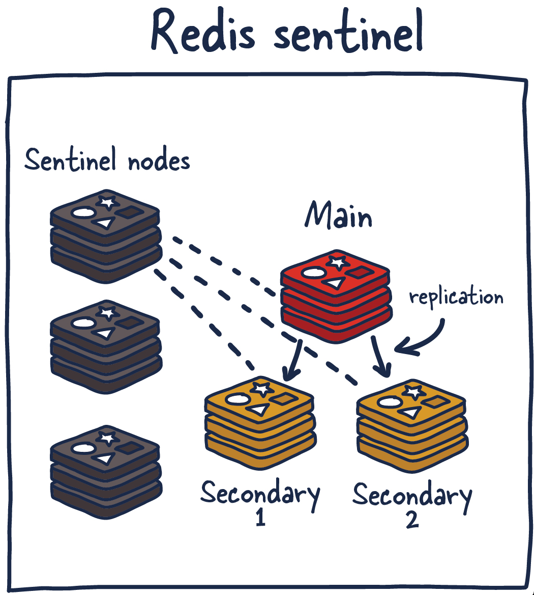
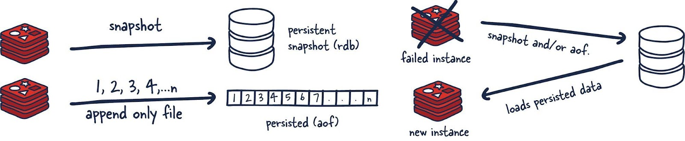

# Introduction to Redis

Redis is an in-memory database that is used primarily as a cache in front of another, "real" database, such as MySQL or PostgreSQL. A Redis-based cache helps improve application performance. It leverages the data speed of memory and offloads the load on the application's central database for handling the following data:

Data that rarely changes, but is accessed frequently by the application.

Non-mission-critical data that changes frequently.

The traditional approach to using Redis is as follows: the client accesses the application, and it receives the data necessary to fulfill its request. First (item 1 in the figure), the application accesses the Redis cache, represented by the main database (Main). If the cache contains data, a cache hit occurs, and the data is returned as usual. If a cache miss occurs (item 2), the system accesses the persistent storage (in this case, the MySQL database). The data from it (item 3) is loaded into the cache, after which the application can use it.



Another important feature of Redis is that it blurs the lines between cache and data storage. The important thing to understand here is that reading data from memory and working with data stored in memory is much faster than the same operations performed by traditional DBMSs using conventional hard disk drives (HDD) or solid-state drives (SSD).

## Data types



Here are the data types supported by Redis:

- String
  This is the simplest data type that can store text or binary data. It is used to cache simple values ​​such as session IDs or authentication tokens.
- Bitmap
  This data type allows bits to be stored and manipulated. It is useful for representing states (e.g. online/offline) and can be used to implement functions such as counting unique users.
- Bitfield
  This is a bit manipulation extension that allows operations on multiple bits at once. This can be useful for storing and manipulating large amounts of data, such as statistics.
- Hash
  Stores a set of key-value pairs. This is useful for storing objects such as user profiles, where each attribute (e.g. name, age) can be represented as a key-value pair.
- List
  This is an ordered collection of strings. Lists can be used to implement queues or stacks, and to store temporary data such as messages.
- Set
  A set of unique elements in no particular order. This is useful for storing collections such as tags or user IDs that should not be repeated.
- Sorted set
  Similar to a set, but each item has a score associated with it that determines its order. This allows you to create ordered lists such as leaderboards.
- Geospatial
  Allows you to store and manipulate geographic data such as coordinates. This is useful for location-based applications.
- HyperLogLog structure
  It is a probabilistic data structure used to count unique elements with minimal memory usage. It can be useful for analyzing large amounts of data.
- Stream
  Allows you to store data sequences that can be used to implement messaging systems or event logs.

## Redis Architecture

Before we start talking about the internal mechanisms of Redis, let's look at the different options for deploying this storage and discuss the trade-offs that those who choose one or another option have to make.

We will mainly focus on the following configurations:

- A single instance of Redis.
- Redis HA.
- Redis Sentinel.
- Redis Cluster.

You can choose one or another configuration depending on the specifics of your project and its scale.

### Single instance of Redis



The simplest and most common configuration is a single instance of Redis running on a single machine. This configuration is easy to set up and maintain, but it has the following drawbacks:

- Single point of failure: If the Redis instance fails, the entire application fails.
- Limited scalability: The Redis instance can only handle a single connection, so it can't handle a large number of concurrent requests.
- Limited data storage: The Redis instance can only store a limited amount of data.

If you give a Redis instance enough memory and server resources, this instance can be quite a powerful entity. This approach is mainly used for caching, and allows you to get a serious increase in project performance with a minimum of effort and time spent on setting up the system. With sufficient server resources, you can deploy such a Redis service on the same machine where the main application is running.

To work successfully with Redis, it is important to understand some of the concepts of the system related to data management. Requests to the Redis database are processed by working with data stored in memory. If the Redis instance being used provides for the use of persistent data storage, the system will have a fork of the process. It uses the RDB (Redis Database) to organize persistent storage of snapshots of data. This is a very compact representation of Redis data at a certain point in time. Instead of RDB, files intended only for appending data (Append-Only File, AOF) can be used.

These two mechanisms allow Redis to have a long-term data storage, support various replication strategies, and help to implement more complex topologies based on Redis. If the Redis server is not configured for persistent data storage, then upon a reboot or system failure, the data is lost. If persistent storage is enabled, then upon a system reboot, the data from the RDB snapshot or from the AOF is loaded into memory. After this, the Redis instance will be able to handle client requests.

### Redis HA



High availability configuration. The system consists of a main database (Main), the leading node, and a secondary database (Secondary), the slave node. The state of the nodes is synchronized by replication.

As data is written to the Redis master, copies of the corresponding commands are sent to the output buffer of the slaves, ensuring data replication. Slaves can contain one or more Redis instances. These instances can help scale data reads or provide fault tolerance in the event of loss of communication with the master.

High Availability (HA) is a characteristic of a system that aims to provide a consistent level of system performance (usually system uptime) over longer-than-average time intervals.

High availability systems are designed to have no single point of failure. This allows them to gracefully and quickly recover from failures. High availability configurations include reliable communication links, which eliminates data loss as it travels from the master to the slave. They also automatically detect and recover from failures.

### Data Replication in Redis

Each Redis master node has an ID and a replication offset. These two metrics are critical to determining when a slave node can continue replicating or when a full data synchronization is needed. The offset is incremented by any action that occurs on the Redis master node.

```
Replication ID, offset
```

To be more specific, when a Redis slave is only a few offset steps behind the master, it receives outstanding commands from the master, these commands are applied to the data, and this continues until the nodes are synchronized. If the two instances cannot agree on a replication ID, or the master has no offset information, the slave requests a full data synchronization. This involves the master creating a new RDB snapshot and sending it to the slave. While sending this data, the master buffers the intermediate data updates that occurred between the snapshot creation and the current time. These updates will be sent to the slave after it synchronizes with the snapshot. Once this process is complete, replication can continue as normal.

If different Redis instances have the same ID and offset, this means that they are storing exactly the same data. This may raise the question of why Redis uses a replication ID. The point is that when a Redis instance is promoted to a master, or if an instance is immediately started as a master, it is assigned a new replication ID. It is used to find out which Redis instance was the master before. Specifically, it finds out which instance the node that was just promoted previously copied data from. This allows partial synchronization (with other slaves) to be performed, since the new master remembers its old replication ID.

For example, two Redis instances, a master and a slave, have the same replication ID, but their offsets differ by several hundred commands. That is, if the corresponding commands are replayed on the “lagging” instance, both instances will have an identical set of data. Let’s assume that the replication IDs of the instances are different and we do not know the previous ID (the instances have no common ancestor) of the node that was recently demoted to a slave (it is connected to the master). In such a situation, we need to perform a resource-intensive full data synchronization operation.

On the other hand, if the previous replication ID is known, we can think about how to synchronize the data of two nodes. Since we know the common ancestor of the nodes, this means that they store common data, and therefore, using the offset, we can perform partial data synchronization.

### Redis Sentinel



Redis Sentinel is a service that enables the creation of distributed systems. And, as with all distributed systems, Sentinel has its strengths and weaknesses. Sentinel is based on a cluster of Sentinel processes working together. They coordinate the state of the system, implementing a high-availability configuration for Redis. Sentinel is a service that protects the Redis storage from failures. Therefore, it is logical that this service should not have a single point of failure.

The Sentinel service solves several problems. First, it ensures the operability and availability of the current master and slave nodes. Thanks to this, the current Sentinel process (along with other similar processes) can react to a situation when communication with the master and/or slave nodes is lost. Second, it plays a certain role in service discovery. Zookeeper and Consul work in a similar way in other systems. That is, when a new client tries to write something to the Redis store, Sentinel will tell the client which Redis instance is currently the master.

So Sentinel nodes constantly monitor the availability of Redis instances and send information about them to clients, which allows clients to take certain actions in cases where the store fails.

Here are the functions that Sentinel nodes perform:

1. Monitoring: Ensure that master and slave nodes are operating as expected.
2. Sending notifications to administrators: The system sends notifications to administrators about incidents in Redis instances.
3. Managing failover: Sentinel nodes can initiate a failover process if the master Redis instance is unavailable and a sufficient number (quorum) of nodes agree that this is the case.
4. Configuration management: Sentinel nodes also act as a system that allows the current master Redis instance to be discovered.

Redis Sentinel can be deployed in a number of ways. Honestly, I'd need details about the setup you plan to use Redis Sentinel in to give any meaningful recommendations. As a general rule, I'd recommend running a Sentinel node alongside each of your application servers (if possible). This will eliminate network connectivity differences between Sentinel nodes and clients running Redis.

Sentinel can also be run on the same machines as Redis instances, or even as independent nodes, but this complicates things in various ways. I recommend at least three nodes with a quorum of at least two.

### Redis Cluster

Clients perform read/write operations by interacting with the master (M1, M2, M3) Redis nodes. Data is replicated between the master and slave (S1, S2, S3). Other clients perform data read operations by accessing the slave nodes. The Gossip protocol is used to determine the overall state of the cluster.

Vertical scaling uses more advanced computers to speed up the system, hoping that the increased computing power will allow it to successfully cope with the growing load. But even if the expectations are met at first, eventually the one using vertical scaling will face the limitations of the hardware.

After vertical scaling has exhausted itself (and most likely, hopefully, long before that), it will be necessary to turn to horizontal scaling. This is the distribution of the load across many small machines responsible for solving small subtasks of one large task.

Let's sort out the terminology. Once we decide to use Redis Cluster, this means that we decide to distribute the data we store across many machines. This is called sharding. As a result, each Redis instance included in the cluster is considered to store a shard, or fragment, of all the data.

This approach brings to life a new problem. If we send data to the cluster, how do we know which Redis instance (shard) is storing this data? There are several ways to do this. Redis Cluster uses algorithmic sharding.

To find a shard for a given key, we hash the key and divide the result modulo the number of shards. Then, using a deterministic hash function (so that a given key will always correspond to the same shard), when we need to read the corresponding data, we can find out where exactly it is stored.

What happens if a new shard is added to the system after some time? This is what is called resharding.

Assuming that the key foo was assigned to shard 0, after resharding it can be assigned to shard 5. But moving data to match its placement to the new shard configuration will be slow and unrealistic if we want storage expansion operations to be performed quickly. This data movement will also have a negative impact on the availability of Redis Cluster.

Redis Cluster has a mechanism to solve this problem. These are the so-called "hash slots" to which data is sent. There are about 16 thousand of these slots. This gives us an adequate way to distribute data across the cluster, and when adding new shards, we just need to move hash slots around the system. By doing this, we only need to move hash slots from shard to shard and simplify the process of adding new master Redis instances to the cluster.

This can be done without system downtime and with minimal impact on its performance. Let's look at an example.

Node M1 contains hash slots from 0 to 8191.

Node M2 ​​contains hash slots from 8192 to 16383.

By assigning a hash slot to key foo, we calculate the deterministic hash of the key (foo) and divide it modulo the number of hash slots (16383). As a result, the data corresponding to this key goes to node M2. Now, suppose we add a new node to the system - M3. The new mapping of nodes to hash slots would be:

- Node M1 contains hash slots 0 through 5460.
- Node M2 ​​contains hash slots 5461 through 10922.
- Node M3 contains hash slots 10923 through 16383.

All keys that were in the hash slots of node M1, now belonging to node M2, would need to be moved. But the mapping of individual keys to hash slots is preserved, since the keys are already distributed across hash slots. Thus, this mechanism solves the resharding problem when using algorithmic sharding.

### Persistent Storage Models in Redis

If you plan to store any data in Redis with the expectation that it will be stored reliably and persistently, it is important to understand how Redis does this. There are many situations where losing data stored in Redis is not such a big deal. For example, using Redis as a cache, or in situations where Redis stores data for some real-time analytics system.

In other cases, developers need some guarantees about the persistence of data and the ability to recover it.

Redis is a fast store, and any guarantees about data integrity are secondary to speed. This is probably a controversial topic, but it is true.

Data from memory is copied either to the RDB, as snapshots, or to AOF. If a Redis instance fails but the instance's data was committed to persistent storage, that data is loaded into a new Redis instance.



### Permanent data storage is not used

If needed, persistent data storage can be disabled. This is the configuration that makes Redis run the fastest, but does not guarantee reliable data storage.

### RDB files

Permanent storage of data in RDB files involves creating snapshots containing data relevant at certain points in time. Snapshots are created at specified time intervals.

The main disadvantage of this mechanism is that data received in the storage between the moments of snapshot creation will be lost if Redis fails. In addition, this data storage mechanism relies on creating a fork of the main process. When working with large data sets, this can lead to short-term delays in query processing. However, RDB files are loaded into memory much faster than AOF.

### AOF files

The AOF-based persistent storage mechanism logs every write operation that the server receives a request to perform. These operations will be replayed when the server starts, which will recreate the original data set.

This approach to persistent data storage is much more reliable than RDB. After all, we are not talking about snapshots of the storage state, but about files designed only for data to be appended to them. When operations occur, they are buffered in the log, but they are not immediately placed in the persistent storage. The log contains the actual commands that, if the data needs to be restored, are run in the order in which they were executed.

Then, when possible, the log is flushed to disk using fsync (the exact time of this process can be configured). After that, the data is in the persistent storage. The downside of this approach is that this data storage format is not compact, it requires more disk space than RDB files.

The fsync() call transfers ("flushes") all modified data from memory (that is, modified file buffer pages) related to the file represented by the file descriptor fd to the disk device (or other device for permanent storage of information). As a result, all modified information can be restored even after a serious failure or reboot of the system.

For various reasons, changes made to an open file first go to the cache, and the fsync() call ensures that they are physically saved to the disk, that is, they can be read from the disk later.

### Forking Redis processes

Now that we've covered the mechanisms for organizing persistent data storage in Redis, let's talk about how this is done in a single-threaded application like Redis.

A fork is when the operating system, on command from a process, creates a new process by copying the parent process. As a result, we have a new process ID and some other useful information at our disposal. In this case, the newly created fork of the process (child process) can interact with the parent process.

Now the fun begins. Redis is a process that has a huge amount of memory allocated. How can we copy such a process and not run out of memory?

When a fork of a process is created, the parent and child processes share memory. Redis begins the process of creating a snapshot in the child process. This is possible thanks to a memory sharing technique called "copy-on-write". In this case, no memory is allocated during the fork creation; references to already allocated memory are used. If nothing in the memory was changed when the child process flushed data to disk, new memory will not be allocated.

In the event that there were changes, the following happens. The operating system kernel keeps track of references to each page of memory. If there is more than one reference to a page, the changes are written to new pages. The child process is unaware of the changes; it has a stable snapshot of the memory. As a result, only a small amount of memory is used to create a fork of the process. We can quickly and efficiently create snapshots that reflect the state of the storage at a certain point in time, the sizes of which can reach many gigabytes.
