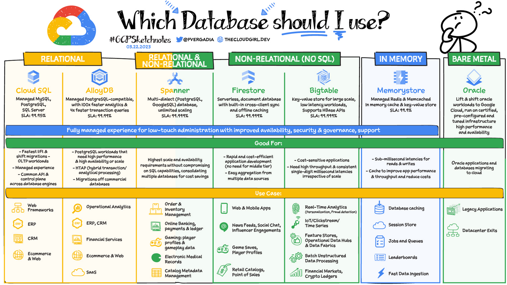
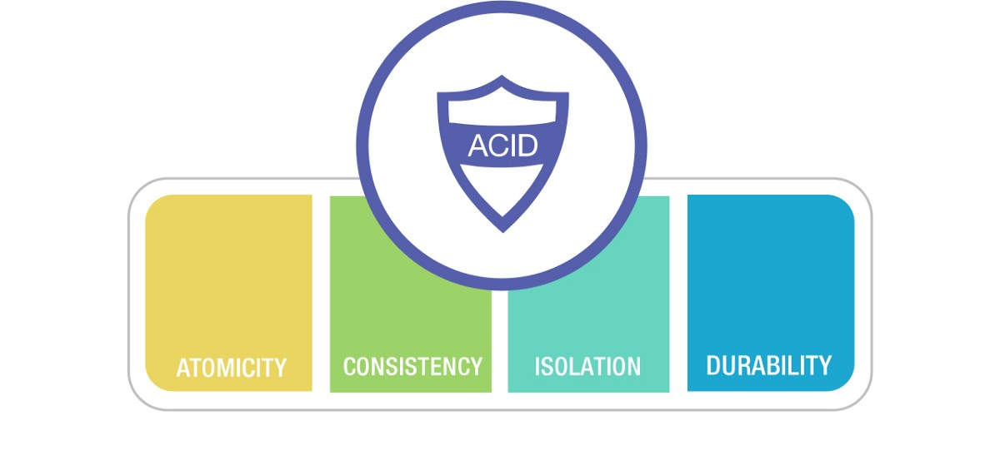
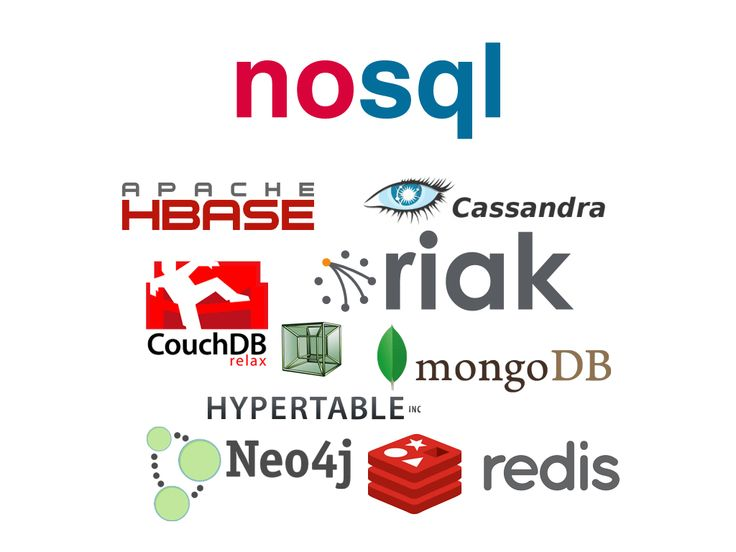
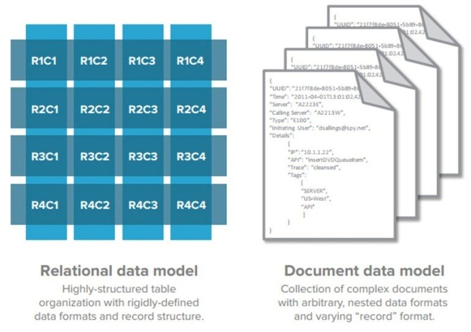
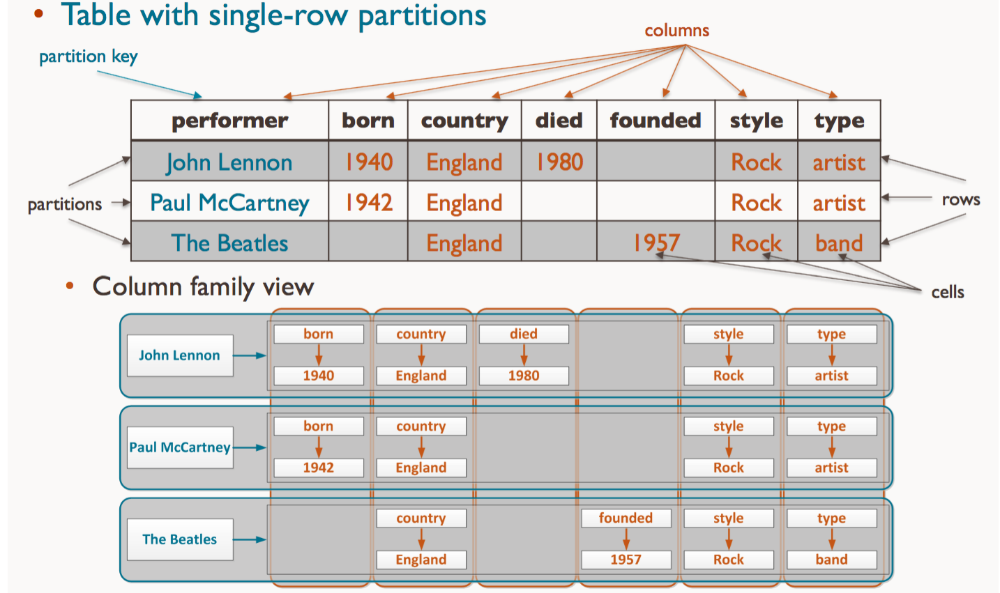
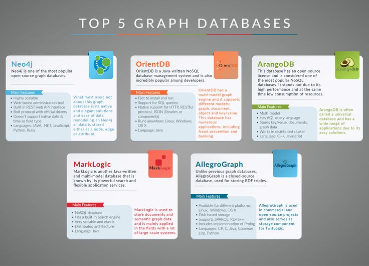

# Non-relational databases

## SQL and NoSQL databases

One of the main issues when choosing a database is choosing between SQL (relational model) and NoSQL (non-relational model) data structures. Both have good performance, but there are some key differences to keep in mind.

### SQL Databases

A relational database is a set of tables that have certain relationships between them. To maintain and query a relational database, a database management system uses Structured Query Language (SQL), a common user application that provides a simple programming interface for interacting with the database.

Relational databases consist of rows called tuples and columns called attributes. Tuples in a table share the same attributes.

#### Advantages of SQL Databases

A relational database is ideal for storing structured data (zip codes, credit card numbers, dates, identification numbers). SQL is a proven technology: it is well documented, has excellent support, and works well with most modern frameworks and libraries. The most prominent examples of SQL databases are PostgreSQL and MySQL. Both have proven themselves to be stable and secure.

Another big advantage of relational databases is their security. Relational databases support access permissions that determine who can read and edit data. The database administrator can grant a specific user the rights to access, select, insert, or delete data. This protects information from being stolen by third parties.

Using a relational database management system (RDBMS) protects data from loss and corruption thanks to the four ACID properties: atomicity, consistency, isolation, and durability. To better understand what this means, suppose two shoppers are trying to buy a red dress of the same size at the same time. If ACID principles are followed, these transactions are guaranteed not to overlap each other.

- Atomicity means that each transaction (a sequence of one or more SQL operations) is treated as a single unit. It can only succeed or fail as a whole: if one of the operations fails, the entire transaction fails. When a user buys a product, money is withdrawn from their account and transferred to the merchant's account. Atomicity ensures that if the transaction to top up the account fails, the withdrawal operation is not performed.
- Consistency means that only valid data that complies with all the rules can be written to the database. If the input data is invalid, the database is reverted to the state before the transaction. This ensures that illegal transactions cannot corrupt the database.
- Isolation means that pending transactions remain isolated. This ensures that all transactions are processed independently and securely.
- Durability means that the system stores data even if the transaction fails. This means that data is not lost even if the system crashes.

Compliance with ACID principles is preferable for applications that handle financial, medical, and sensitive personal data, as it automatically provides security and privacy to users. All these advantages make relational databases ideal for financial and medical projects.

#### Disadvantages of relational databases

- They lack flexibility. Relational databases cannot effectively handle semi-structured and unstructured data, so they are not well suited for large workloads and IoT analytics.
- As the data structure becomes more complex, it becomes increasingly difficult to transfer information from one big data-oriented software solution to another. In large organizations, relational databases often grow independently in separate departments.
- Relational databases only run on a single server. Therefore, in order for your DBMS to cope with even more data, you will have to spend money on expensive physical hardware.

These shortcomings forced developers to look for alternatives to relational databases. As a result, NoSQL and NewSQL databases appeared.

### NoSQL Databases

NoSQL databases, also known as non-relational or distributed databases, are an alternative to relational databases. They offer developers greater flexibility and scalability because they can store and process unstructured data (social media data, photos, MP3s, etc.).

Data in non-relational databases can be changed dynamically without affecting existing data. In addition, NoSQL databases can run on multiple servers, making them cheaper and easier to scale than SQL databases.

And because NoSQL databases are not dependent on a single server, they are more fault-tolerant. This means that if one component fails, the database can continue to operate.

However, NoSQL databases have not yet matured to the same level as SQL databases, and the NoSQL environment is not as well defined. In addition, NoSQL databases often sacrifice ACID principles for availability and flexibility.

NoSQL databases can be divided into four types.

#### Key-Value Stores

This is the simplest type of NoSQL database that can only store key-value pairs and offers basic functions for retrieving the value associated with a key. A key-value store is a great option if you want to quickly find information using a key. The most prominent examples of this type of store are Amazon DynamoDB and Redis.

Due to their simple database structure, DynamoDB and Redis are extremely easy to scale. With no relationships between values ​​and no mandatory schema, the number of values ​​is limited only by the power of the computer.

This is why key-value stores are used by hosting providers like ScaleGrid, Compose, and Redis Labs. Developers often use key-value stores for caching data. They are also good for storing blog comments, product reviews, user profiles, and various settings.

These databases are the easiest to scale horizontally, meaning you can add more servers to store even more data. This is less expensive than scaling a relational database, but can lead to higher utility bills for cooling and electricity.

However, the simplicity of key-value stores can also be a disadvantage. Most operations that are possible in other database types are difficult or impossible to perform with a key-value store. While key lookups are indeed very fast, value lookups can take much longer.

In most cases, key-value stores are used in conjunction with another type of database. In the Healthfully and KPMG applications, we used the Redis key-value store with the PostgreSQL relational database management system.

#### Document Stores

In document-oriented databases, all information related to a particular object is stored in a single file in BSON, JSON, or XML format. Similar documents can be grouped into so-called collections or lists. These databases allow developers to not worry about data types and reliable relationships.

A document-oriented database model is usually a tree or forest. In a tree structure, the root node has one or more leaf nodes. A forest structure consists of several trees. These data structures help perform fast searches in document repositories. This makes it difficult to manage complex systems with numerous relationships between elements, but it allows developers to create collections of documents by topic or type.

For example, if you are building a music streaming app, you could use a document-oriented database to create a collection of Rihanna songs so that users can easily find her tracks.

In the name of flexibility, document-oriented databases sacrifice the guarantees provided by ACID principles. MongoDB and Couchbase are excellent examples of document-oriented databases.

Because of their structure and flexibility, document-oriented databases are commonly used for content management, rapid prototyping, and data analysis.

#### Column-Family Databases

A columnar database is optimized for fast retrieval of columns of data. In columnar databases, each column is stored as a logical array of values. This type of database provides high scalability and is easily duplicated.

Columnar storage works with both structured and unstructured data, making database searches as easy as possible. Columnar databases are very fast at handling analytical operations, but perform poorly when handling transactions. Apache Cassandra and Scylla are among the most popular columnar storages.

#### Graph Databases

In a graph storage, each unit of data, called a node, is an isolated document of free-form data. Nodes are connected by edges that define the relationships between them.

This approach simplifies data visualization and graph analysis. Graph databases are commonly used to determine the relationships between data points. Most graph databases support features such as finding the node with the most links and finding all connected nodes.

Graph databases are optimized for projects with graph data structures, such as social networks and the semantic web. Neo4J and Datastax Enterprise are the best examples of graph databases.

Graph databases are used in the Healthfully and KPMG applications to store the relationships between users and their health records.

## NewSQL Databases

Of particular note is NewSQL, a class of relational databases that combines the capabilities of SQL and NoSQL databases.

NewSQL databases are designed to solve common problems of SQL databases associated with traditional online transaction processing. NewSQL inherited from NoSQL the optimization of online transaction processing, scalability, flexibility, and serverless architecture. At the same time, NewSQL structures, like relational databases, support the principles of ACID and consistency. They can scale, often on demand, without affecting the logic of the application and without violating the transaction model.

The NewSQL class appeared in 2011 and has not yet gained much popularity. It implements only a part of the rich SQL toolkit. Flexibility and serverless architecture, combined with a high degree of security and availability without the use of backup systems - all this increases the chances of NewSQL to become a next-generation solution for cloud technologies.

The most popular NewSQL databases are ClustrixDB, CockroachDB, NuoDB, MemSQL and VoltDB.
